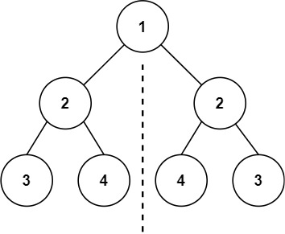
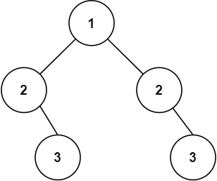

# [101\. 对称二叉树](https://leetcode.cn/problems/symmetric-tree/)

简单

给你一个二叉树的根节点 `root` ， 检查它是否轴对称。

&nbsp;

**示例 1：**

**输入：**root = \[1,2,2,3,4,4,3\]
**输出：**true

**示例 2：**

**输入：**root = \[1,2,2,null,3,null,3\]
**输出：**false

&nbsp;

**提示：**

- 树中节点数目在范围 `[1, 1000]` 内
- `-100 <= Node.val <= 100`

&nbsp;

**进阶：**你可以运用递归和迭代两种方法解决这个问题吗？

通过次数 961.4K

提交次数 1.6M

通过率 59.6%

* * *

相关标签

[树](https://leetcode.cn/tag/tree/)
[深度优先搜索](https://leetcode.cn/tag/depth-first-search/)
[广度优先搜索](https://leetcode.cn/tag/breadth-first-search/)
[二叉树](https://leetcode.cn/tag/binary-tree/)

* * *