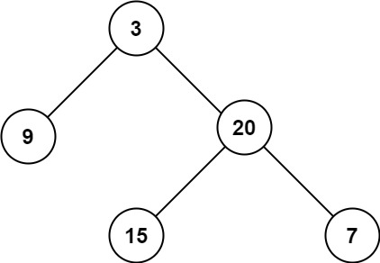

# [104\. 二叉树的最大深度](https://leetcode.cn/problems/maximum-depth-of-binary-tree/)

简单

给定一个二叉树 `root` ，返回其最大深度。

二叉树的 **最大深度** 是指从根节点到最远叶子节点的最长路径上的节点数。

&nbsp;

**示例 1：**

&nbsp;

**输入：**root = \[3,9,20,null,null,15,7\]
**输出：**3

**示例 2：**

**输入：**root = \[1,null,2\]
**输出：**2

&nbsp;

**提示：**

- 树中节点的数量在 `[0, 104]` 区间内。
- `-100 <= Node.val <= 100`

通过次数 1.2M

提交次数 1.5M

通过率 77.3%

* * *

相关标签

[树](https://leetcode.cn/tag/tree/)
[深度优先搜索](https://leetcode.cn/tag/depth-first-search/)
[广度优先搜索](https://leetcode.cn/tag/breadth-first-search/)
[二叉树](https://leetcode.cn/tag/binary-tree/)

* * *

相似题目

[平衡二叉树](https://leetcode.cn/problems/balanced-binary-tree/) 简单

[二叉树的最小深度](https://leetcode.cn/problems/minimum-depth-of-binary-tree/) 简单

[N 叉树的最大深度](https://leetcode.cn/problems/maximum-depth-of-n-ary-tree/) 简单

* * *