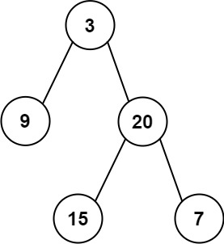

# [106\. 从中序与后序遍历序列构造二叉树](https://leetcode.cn/problems/construct-binary-tree-from-inorder-and-postorder-traversal/)

中等

给定两个整数数组 `inorder` 和 `postorder` ，其中 `inorder` 是二叉树的中序遍历， `postorder` 是同一棵树的后序遍历，请你构造并返回这颗 *二叉树* 。

&nbsp;

**示例 1:**

**输入：**inorder = \[9,3,15,20,7\], postorder = \[9,15,7,20,3\]
**输出：**\[3,9,20,null,null,15,7\]

**示例 2:**

**输入：**inorder = \[-1\], postorder = \[-1\]
**输出：**\[-1\]

&nbsp;

**提示:**

- `1 <= inorder.length <= 3000`
- `postorder.length == inorder.length`
- `-3000 <= inorder[i], postorder[i] <= 3000`
- `inorder` 和 `postorder` 都由 **不同** 的值组成
- `postorder` 中每一个值都在 `inorder` 中
- `inorder` **保证**是树的中序遍历
- `postorder` **保证**是树的后序遍历

* * *

通过次数 364.3K

提交次数 504.3K

通过率 72.2%

* * *

相关标签

[树](https://leetcode.cn/tag/tree/)
[数组](https://leetcode.cn/tag/array/)
[哈希表](https://leetcode.cn/tag/hash-table/)
[分治](https://leetcode.cn/tag/divide-and-conquer/)
[二叉树](https://leetcode.cn/tag/binary-tree/)

* * *

相似题目

[从前序与中序遍历序列构造二叉树](https://leetcode.cn/problems/construct-binary-tree-from-preorder-and-inorder-traversal/) 中等

* * *