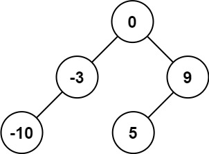
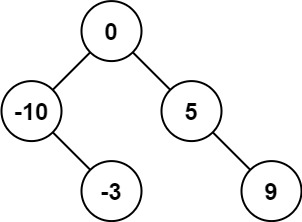
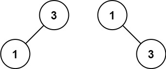

# [108\. 将有序数组转换为二叉搜索树](https://leetcode.cn/problems/convert-sorted-array-to-binary-search-tree/)

简单

给你一个整数数组 `nums` ，其中元素已经按 **升序** 排列，请你将其转换为一棵

平衡

二叉搜索树。

&nbsp;

**示例 1：**

**输入：**nums = \[-10,-3,0,5,9\]
**输出：**\[0,-3,9,-10,null,5\]
**解释：**\[0,-10,5,null,-3,null,9\] 也将被视为正确答案：

**示例 2：**

**输入：**nums = \[1,3\]
**输出：**\[3,1\]
**解释：**\[1,null,3\] 和 \[3,1\] 都是高度平衡二叉搜索树。

&nbsp;

**提示：**

- `1 <= nums.length <= 104`
- `-104 <= nums[i] <= 104`
- `nums` 按 **严格递增** 顺序排列

* * *

通过次数 455.7K

提交次数 582.2K

通过率 78.3%

* * *

相关标签

[树](https://leetcode.cn/tag/tree/)
[二叉搜索树](https://leetcode.cn/tag/binary-search-tree/)
[数组](https://leetcode.cn/tag/array/)
[分治](https://leetcode.cn/tag/divide-and-conquer/)
[二叉树](https://leetcode.cn/tag/binary-tree/)

* * *

相似题目

[有序链表转换二叉搜索树](https://leetcode.cn/problems/convert-sorted-list-to-binary-search-tree/) 中等

* * *