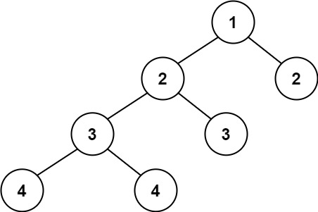

# [110\. 平衡二叉树](https://leetcode.cn/problems/balanced-binary-tree/)

简单

给定一个二叉树，判断它是否是高度平衡的二叉树。

本题中，一棵高度平衡二叉树定义为：

> 一个二叉树*每个节点* 的左右两个子树的高度差的绝对值不超过 1 。

&nbsp;

**示例 1：**

**输入：**root = \[3,9,20,null,null,15,7\]
**输出：**true

**示例 2：**

**输入：**root = \[1,2,2,3,3,null,null,4,4\]
**输出：**false

**示例 3：**

**输入：**root = \[\]
**输出：**true

&nbsp;

**提示：**

- 树中的节点数在范围 `[0, 5000]` 内
- `-104 <= Node.val <= 104`

通过次数 572.3K

提交次数 986K

通过率 58.0%

* * *

相关标签

[树](https://leetcode.cn/tag/tree/)
[深度优先搜索](https://leetcode.cn/tag/depth-first-search/)
[二叉树](https://leetcode.cn/tag/binary-tree/)

* * *

相似题目

[二叉树的最大深度](https://leetcode.cn/problems/maximum-depth-of-binary-tree/) 简单

* * *