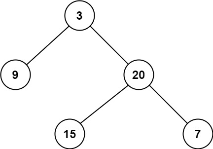

# [111\. 二叉树的最小深度](https://leetcode.cn/problems/minimum-depth-of-binary-tree/)

简单

给定一个二叉树，找出其最小深度。

最小深度是从根节点到最近叶子节点的最短路径上的节点数量。

**说明：**叶子节点是指没有子节点的节点。

&nbsp;

**示例 1：**

**输入：**root = \[3,9,20,null,null,15,7\]
**输出：**2

**示例 2：**

**输入：**root = \[2,null,3,null,4,null,5,null,6\]
**输出：**5

&nbsp;

**提示：**

- 树中节点数的范围在 `[0, 105]` 内
- `-1000 <= Node.val <= 1000`

通过次数 639.8K

提交次数 1.2M

通过率 53.3%

* * *

相关标签

[树](https://leetcode.cn/tag/tree/)[深度优先搜索](https://leetcode.cn/tag/depth-first-search/)[广度优先搜索](https://leetcode.cn/tag/breadth-first-search/)[二叉树](https://leetcode.cn/tag/binary-tree/)

* * *

相似题目

[二叉树的层序遍历](https://leetcode.cn/problems/binary-tree-level-order-traversal/) 中等

[二叉树的最大深度](https://leetcode.cn/problems/maximum-depth-of-binary-tree/) 简单

* * *