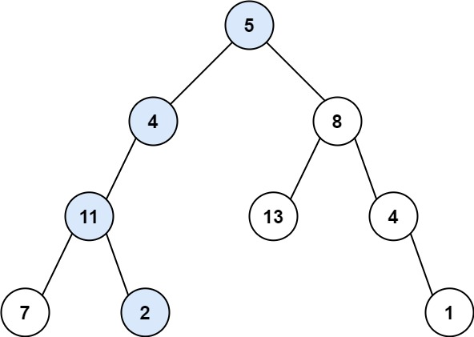
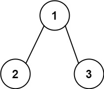

# [112\. 路径总和](https://leetcode.cn/problems/path-sum/)

简单

给你二叉树的根节点 `root` 和一个表示目标和的整数 `targetSum` 。判断该树中是否存在 **根节点到叶子节点** 的路径，这条路径上所有节点值相加等于目标和 `targetSum` 。如果存在，返回 `true` ；否则，返回 `false` 。

**叶子节点** 是指没有子节点的节点。

&nbsp;

**示例 1：**

**输入：**root = \[5,4,8,11,null,13,4,7,2,null,null,null,1\], targetSum = 22
**输出：**true
**解释：**等于目标和的根节点到叶节点路径如上图所示。

**示例 2：**

**输入：**root = \[1,2,3\], targetSum = 5
**输出：**false
**解释：**树中存在两条根节点到叶子节点的路径：
(1 --> 2): 和为 3
(1 --> 3): 和为 4
不存在 sum = 5 的根节点到叶子节点的路径。

**示例 3：**

**输入：**root = \[\], targetSum = 0
**输出：**false
**解释：**由于树是空的，所以不存在根节点到叶子节点的路径。

&nbsp;

**提示：**

- 树中节点的数目在范围 `[0, 5000]` 内
- `-1000 <= Node.val <= 1000`
- `-1000 <= targetSum <= 1000`

通过次数 646.5K

提交次数 1.2M

通过率 54.1%

* * *

相关标签

[树](https://leetcode.cn/tag/tree/)
[深度优先搜索](https://leetcode.cn/tag/depth-first-search/)
[广度优先搜索](https://leetcode.cn/tag/breadth-first-search/)
[二叉树](https://leetcode.cn/tag/binary-tree/)

* * *

相似题目

[路径总和 II](https://leetcode.cn/problems/path-sum-ii/) 中等

[二叉树中的最大路径和](https://leetcode.cn/problems/binary-tree-maximum-path-sum/) 困难

[求根节点到叶节点数字之和](https://leetcode.cn/problems/sum-root-to-leaf-numbers/) 中等

[路径总和 III](https://leetcode.cn/problems/path-sum-iii/) 中等

[路径总和 IV](https://leetcode.cn/problems/path-sum-iv/) 中等

* * *