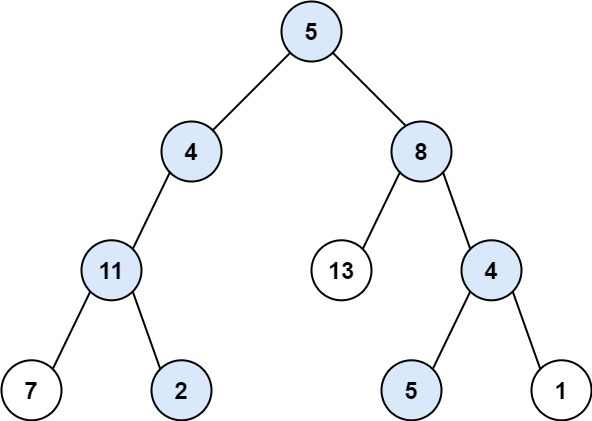
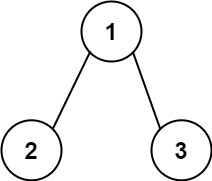

# [113\. 路径总和 II](https://leetcode.cn/problems/path-sum-ii/)

中等

给你二叉树的根节点 `root` 和一个整数目标和 `targetSum` ，找出所有 **从根节点到叶子节点** 路径总和等于给定目标和的路径。

**叶子节点** 是指没有子节点的节点。

&nbsp;

**示例 1：**

**输入：**root = \[5,4,8,11,null,13,4,7,2,null,null,5,1\], targetSum = 22
**输出：**\[\[5,4,11,2\],\[5,8,4,5\]\]

**示例 2：**

**输入：**root = \[1,2,3\], targetSum = 5
**输出：**\[\]

**示例 3：**

**输入：**root = \[1,2\], targetSum = 0
**输出：**\[\]

&nbsp;

**提示：**

- 树中节点总数在范围 `[0, 5000]` 内
- `-1000 <= Node.val <= 1000`
- `-1000 <= targetSum <= 1000`

* * *

通过次数 394.5K

提交次数 623.5K

通过率 63.3%

* * *

相关标签

[树](https://leetcode.cn/tag/tree/)
[深度优先搜索](https://leetcode.cn/tag/depth-first-search/)
[回溯](https://leetcode.cn/tag/backtracking/)
[二叉树](https://leetcode.cn/tag/binary-tree/)

* * *

相似题目

[路径总和](https://leetcode.cn/problems/path-sum/) 简单

[二叉树的所有路径](https://leetcode.cn/problems/binary-tree-paths/) 简单

[路径总和 III](https://leetcode.cn/problems/path-sum-iii/) 中等

[路径总和 IV](https://leetcode.cn/problems/path-sum-iv/) 中等

* * *