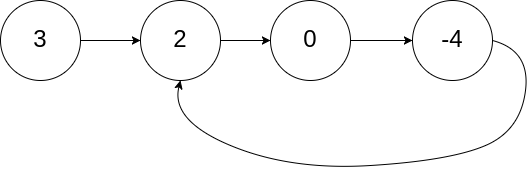
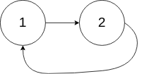
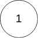

# [142\. 环形链表 II](https://leetcode.cn/problems/linked-list-cycle-ii/)

中等

给定一个链表的头节点  `head` ，返回链表开始入环的第一个节点。 *如果链表无环，则返回 `null`。*

如果链表中有某个节点，可以通过连续跟踪 `next` 指针再次到达，则链表中存在环。 为了表示给定链表中的环，评测系统内部使用整数 `pos` 来表示链表尾连接到链表中的位置（**索引从 0 开始**）。如果 `pos` 是 `-1`，则在该链表中没有环。**注意：`pos` 不作为参数进行传递**，仅仅是为了标识链表的实际情况。

**不允许修改** 链表。

&nbsp;

**示例 1：**

**输入：**head = \[3,2,0,-4\], pos = 1
**输出：**返回索引为 1 的链表节点
**解释：**链表中有一个环，其尾部连接到第二个节点。

**示例 2：**

**输入：**head = \[1,2\], pos = 0
**输出：**返回索引为 0 的链表节点
**解释：**链表中有一个环，其尾部连接到第一个节点。

**示例 3：**

**输入：**head = \[1\], pos = -1
**输出：**返回 null
**解释：**链表中没有环。

&nbsp;

**提示：**

- 链表中节点的数目范围在范围 `[0, 104]` 内
- `-105 <= Node.val <= 105`
- `pos` 的值为 `-1` 或者链表中的一个有效索引

&nbsp;

**进阶：**你是否可以使用 `O(1)` 空间解决此题？

通过次数 797.4K

提交次数 1.4M

通过率 58.1%

* * *

相似题目

[环形链表](https://leetcode.cn/problems/linked-list-cycle/)

简单

[寻找重复数](https://leetcode.cn/problems/find-the-duplicate-number/)

中等

* * *

相关标签

[哈希表](https://leetcode.cn/tag/hash-table/)[链表](https://leetcode.cn/tag/linked-list/)[双指针](https://leetcode.cn/tag/two-pointers/)

* * *