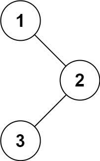
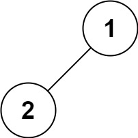
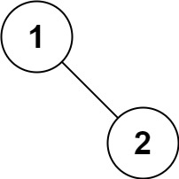

# [144\. 二叉树的前序遍历](https://leetcode.cn/problems/binary-tree-preorder-traversal/)

简单

给你二叉树的根节点 `root` ，返回它节点值的 **前序** 遍历。

&nbsp;

**示例 1：**

**输入：**root = \[1,null,2,3\]
**输出：**\[1,2,3\]

**示例 2：**

**输入：**root = \[\]
**输出：**\[\]

**示例 3：**

**输入：**root = \[1\]
**输出：**\[1\]

**示例 4：**

**输入：**root = \[1,2\]
**输出：**\[1,2\]

**示例 5：**

**输入：**root = \[1,null,2\]
**输出：**\[1,2\]

&nbsp;

**提示：**

- 树中节点数目在范围 `[0, 100]` 内
- `-100 <= Node.val <= 100`

&nbsp;

**进阶：**递归算法很简单，你可以通过迭代算法完成吗？

通过次数 985.4K

提交次数 1.4M

通过率 71.5%

* * *

相关标签

[栈](https://leetcode.cn/tag/stack/)[树](https://leetcode.cn/tag/tree/)[深度优先搜索](https://leetcode.cn/tag/depth-first-search/)[二叉树](https://leetcode.cn/tag/binary-tree/)

* * *

相似题目

[二叉树的中序遍历](https://leetcode.cn/problems/binary-tree-inorder-traversal/) 简单

[验证二叉搜索树的前序遍历序列](https://leetcode.cn/problems/verify-preorder-sequence-in-binary-search-tree/) 中等

[N 叉树的前序遍历](https://leetcode.cn/problems/n-ary-tree-preorder-traversal/) 简单

* * *