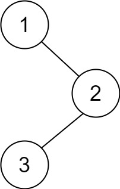

# [145\. 二叉树的后序遍历](https://leetcode.cn/problems/binary-tree-postorder-traversal/)

简单

给你一棵二叉树的根节点 `root` ，返回其节点值的 **后序遍历** 。

&nbsp;

**示例 1：**

**输入：**root = \[1,null,2,3\]
**输出：**\[3,2,1\]

**示例 2：**

**输入：**root = \[\]
**输出：**\[\]

**示例 3：**

**输入：**root = \[1\]
**输出：**\[1\]

&nbsp;

**提示：**

- 树中节点的数目在范围 `[0, 100]` 内
- `-100 <= Node.val <= 100`

&nbsp;

**进阶：**递归算法很简单，你可以通过迭代算法完成吗？

通过次数 712.8K

提交次数 933.2K

通过率 76.4%

* * *

相关标签

[栈](https://leetcode.cn/tag/stack/)[树](https://leetcode.cn/tag/tree/)[深度优先搜索](https://leetcode.cn/tag/depth-first-search/)[二叉树](https://leetcode.cn/tag/binary-tree/)

* * *

相似题目

[二叉树的中序遍历](https://leetcode.cn/problems/binary-tree-inorder-traversal/) 简单

[N 叉树的后序遍历](https://leetcode.cn/problems/n-ary-tree-postorder-traversal/) 简单

* * *