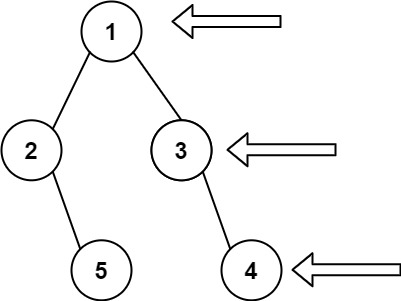

# [199\. 二叉树的右视图](https://leetcode.cn/problems/binary-tree-right-side-view/)

中等

给定一个二叉树的 **根节点** `root`，想象自己站在它的右侧，按照从顶部到底部的顺序，返回从右侧所能看到的节点值。

&nbsp;

**示例 1:**

**输入:** \[1,2,3,null,5,null,4\]
**输出:** \[1,3,4\]

**示例 2:**

**输入:** \[1,null,3\]
**输出:** \[1,3\]

**示例 3:**

**输入:** \[\]
**输出:** \[\]

&nbsp;

**提示:**

- 二叉树的节点个数的范围是 `[0,100]`
- `-100 <= Node.val <= 100` 

通过次数 356.7K

提交次数 536.7K

通过率 66.5%

* * *

相关标签

[树](https://leetcode.cn/tag/tree/)[深度优先搜索](https://leetcode.cn/tag/depth-first-search/)[广度优先搜索](https://leetcode.cn/tag/breadth-first-search/)[二叉树](https://leetcode.cn/tag/binary-tree/)

* * *

相似题目

[填充每个节点的下一个右侧节点指针](https://leetcode.cn/problems/populating-next-right-pointers-in-each-node/) 中等

[二叉树的边界](https://leetcode.cn/problems/boundary-of-binary-tree/) 中等

* * *