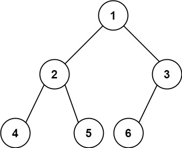

# [222\. 完全二叉树的节点个数](https://leetcode.cn/problems/count-complete-tree-nodes/)

简单

给你一棵 **完全二叉树** 的根节点 `root` ，求出该树的节点个数。

[完全二叉树](https://baike.baidu.com/item/%E5%AE%8C%E5%85%A8%E4%BA%8C%E5%8F%89%E6%A0%91/7773232?fr=aladdin) 的定义如下：在完全二叉树中，除了最底层节点可能没填满外，其余每层节点数都达到最大值，并且最下面一层的节点都集中在该层最左边的若干位置。若最底层为第 `h` 层，则该层包含 `1~ 2h` 个节点。

&nbsp;

**示例 1：**

**输入：**root = \[1,2,3,4,5,6\]
**输出：**6

**示例 2：**

**输入：**root = \[\]
**输出：**0

**示例 3：**

**输入：**root = \[1\]
**输出：**1

&nbsp;

**提示：**

- 树中节点的数目范围是`[0, 5 * 104]`
- `0 <= Node.val <= 5 * 104`
- 题目数据保证输入的树是 **完全二叉树**

&nbsp;

**进阶：**遍历树来统计节点是一种时间复杂度为 `O(n)` 的简单解决方案。你可以设计一个更快的算法吗？

通过次数 350.3K

提交次数 430.9K

通过率 81.3%

* * *

相关标签

[位运算](https://leetcode.cn/tag/bit-manipulation/)
[树](https://leetcode.cn/tag/tree/)
[二分查找](https://leetcode.cn/tag/binary-search/)
[二叉树](https://leetcode.cn/tag/binary-tree/)

* * *

相似题目

[最接近的二叉搜索树值](https://leetcode.cn/problems/closest-binary-search-tree-value/) 简单

* * *