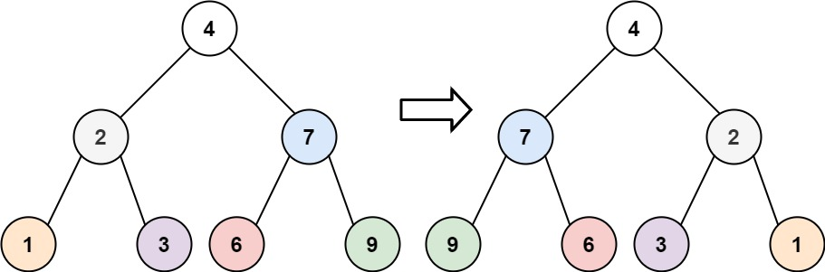
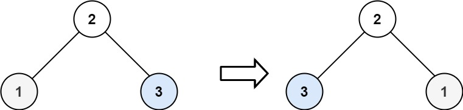

# [226\. 翻转二叉树](https://leetcode.cn/problems/invert-binary-tree/)

简单

给你一棵二叉树的根节点 `root` ，翻转这棵二叉树，并返回其根节点。

&nbsp;

**示例 1：**

**输入：**root = \[4,2,7,1,3,6,9\]
**输出：**\[4,7,2,9,6,3,1\]

**示例 2：**

**输入：**root = \[2,1,3\]
**输出：**\[2,3,1\]

**示例 3：**

**输入：**root = \[\]
**输出：**\[\]

&nbsp;

**提示：**

- 树中节点数目范围在 `[0, 100]` 内
- `-100 <= Node.val <= 100`

通过次数 794K

提交次数 993K

通过率 80.0%

* * *

相关标签

[树](https://leetcode.cn/tag/tree/)
[深度优先搜索](https://leetcode.cn/tag/depth-first-search/)
[广度优先搜索](https://leetcode.cn/tag/breadth-first-search/)
[二叉树](https://leetcode.cn/tag/binary-tree/)

* * *