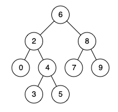

# [235\. 二叉搜索树的最近公共祖先](https://leetcode.cn/problems/lowest-common-ancestor-of-a-binary-search-tree/)

中等

给定一个二叉搜索树, 找到该树中两个指定节点的最近公共祖先。

[百度百科](https://baike.baidu.com/item/%E6%9C%80%E8%BF%91%E5%85%AC%E5%85%B1%E7%A5%96%E5%85%88/8918834?fr=aladdin)中最近公共祖先的定义为：“对于有根树 T 的两个结点 p、q，最近公共祖先表示为一个结点 x，满足 x 是 p、q 的祖先且 x 的深度尽可能大（**一个节点也可以是它自己的祖先**）。”

例如，给定如下二叉搜索树:  root = \[6,2,8,0,4,7,9,null,null,3,5\]

&nbsp;

**示例 1:**

**输入:** root = \[6,2,8,0,4,7,9,null,null,3,5\], p = 2, q = 8
**输出:** 6 
**解释:** 节点 `2` 和节点 `8` 的最近公共祖先是 `6。`

**示例 2:**

**输入:** root = \[6,2,8,0,4,7,9,null,null,3,5\], p = 2, q = 4
**输出:** 2
**解释:** 节点 `2` 和节点 `4` 的最近公共祖先是 `2`, 因为根据定义最近公共祖先节点可以为节点本身。

&nbsp;

**说明:**

- 所有节点的值都是唯一的。
- p、q 为不同节点且均存在于给定的二叉搜索树中。

* * *

通过次数 415.7K

提交次数 593.6K

通过率 70.0%

* * *

相关标签

[树](https://leetcode.cn/tag/tree/)
[深度优先搜索](https://leetcode.cn/tag/depth-first-search/)
[二叉搜索树](https://leetcode.cn/tag/binary-search-tree/)
[二叉树](https://leetcode.cn/tag/binary-tree/)

* * *

相似题目

[二叉树的最近公共祖先](https://leetcode.cn/problems/lowest-common-ancestor-of-a-binary-tree/) 中等

[最小公共区域](https://leetcode.cn/problems/smallest-common-region/) 中等

* * *