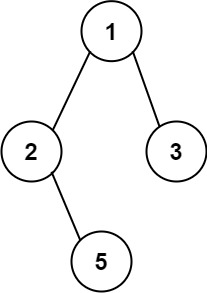

# [257\. 二叉树的所有路径](https://leetcode.cn/problems/binary-tree-paths/)

简单

给你一个二叉树的根节点 `root` ，按 **任意顺序** ，返回所有从根节点到叶子节点的路径。

**叶子节点** 是指没有子节点的节点。

 

**示例 1：**

**输入：**root = \[1,2,3,null,5\]
**输出：**\["1->2->5","1->3"\]

**示例 2：**

**输入：**root = \[1\]
**输出：**\["1"\]

&nbsp;

**提示：**

- 树中节点的数目在范围 `[1, 100]` 内
- `-100 <= Node.val <= 100`

通过次数 364.6K

提交次数 515.7K

通过率 70.7%

* * *

相关标签

[树](https://leetcode.cn/tag/tree/)
[深度优先搜索](https://leetcode.cn/tag/depth-first-search/)
[字符串](https://leetcode.cn/tag/string/)
[回溯](https://leetcode.cn/tag/backtracking/)
[二叉树](https://leetcode.cn/tag/binary-tree/)

* * *

相似题目

[路径总和 II](https://leetcode.cn/problems/path-sum-ii/) 中等

[从叶结点开始的最小字符串](https://leetcode.cn/problems/smallest-string-starting-from-leaf/) 中等

* * *