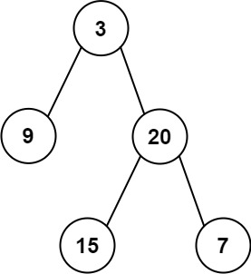

# [404\. 左叶子之和](https://leetcode.cn/problems/sum-of-left-leaves/)

简单

给定二叉树的根节点 `root` ，返回所有左叶子之和。

&nbsp;

**示例 1：**

**输入:** root = \[3,9,20,null,null,15,7\] 
**输出:** 24 
**解释:** 在这个二叉树中，有两个左叶子，分别是 9 和 15，所以返回 24

**示例 2:**

**输入:** root = \[1\]
**输出:** 0

&nbsp;

**提示:**

- 节点数在 `[1, 1000]` 范围内
- `-1000 <= Node.val <= 1000`

&nbsp;

* * *

通过次数 284.7K

提交次数 454.3K

通过率 62.7%

* * *

相关标签

[树](https://leetcode.cn/tag/tree/)
[深度优先搜索](https://leetcode.cn/tag/depth-first-search/)
[广度优先搜索](https://leetcode.cn/tag/breadth-first-search/)
[二叉树](https://leetcode.cn/tag/binary-tree/)
