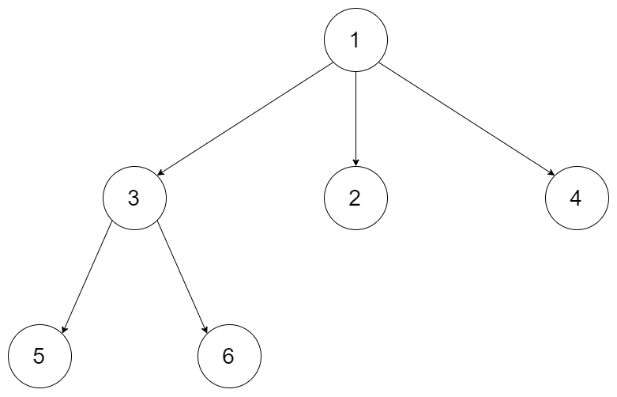
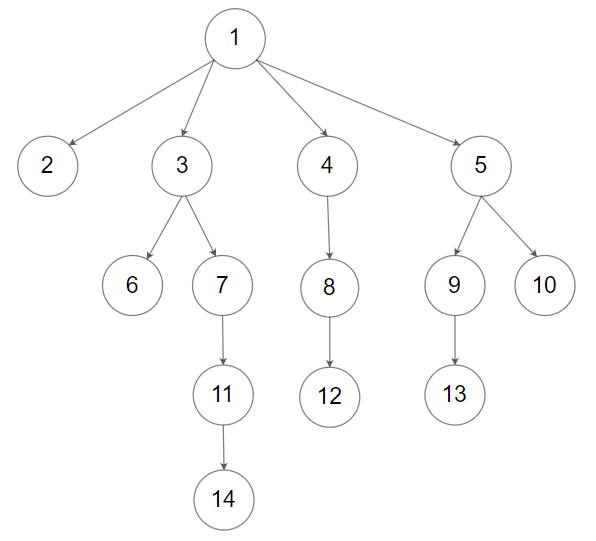

# [429\. N 叉树的层序遍历](https://leetcode.cn/problems/n-ary-tree-level-order-traversal/)

中等

给定一个 N 叉树，返回其节点值的*层序遍历*。（即从左到右，逐层遍历）。

树的序列化输入是用层序遍历，每组子节点都由 null 值分隔（参见示例）。

&nbsp;

**示例 1：**

**输入：**root = \[1,null,3,2,4,null,5,6\]
**输出：**\[\[1\],\[3,2,4\],\[5,6\]\]

**示例 2：**

**输入：**root = \[1,null,2,3,4,5,null,null,6,7,null,8,null,9,10,null,null,11,null,12,null,13,null,null,14\]
**输出：**\[\[1\],\[2,3,4,5\],\[6,7,8,9,10\],\[11,12,13\],\[14\]\]

&nbsp;

**提示：**

- 树的高度不会超过 `1000`
- 树的节点总数在 `[0, 10^4]` 之间

通过次数 174.5K

提交次数 238.8K

通过率 73.1%

* * *

相关标签

[树](https://leetcode.cn/tag/tree/)[广度优先搜索](https://leetcode.cn/tag/breadth-first-search/)

* * *

相似题目

[二叉树的层序遍历](https://leetcode.cn/problems/binary-tree-level-order-traversal/) 中等

[N 叉树的前序遍历](https://leetcode.cn/problems/n-ary-tree-preorder-traversal/) 简单

[N 叉树的后序遍历](https://leetcode.cn/problems/n-ary-tree-postorder-traversal/) 简单

* * *