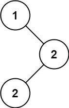

[501\. 二叉搜索树中的众数](https://leetcode.cn/problems/find-mode-in-binary-search-tree/)

简单

给你一个含重复值的二叉搜索树（BST）的根节点 `root` ，找出并返回 BST 中的所有 [众数](https://baike.baidu.com/item/%E4%BC%97%E6%95%B0/44796)（即，出现频率最高的元素）。

如果树中有不止一个众数，可以按 **任意顺序** 返回。

假定 BST 满足如下定义：

- 结点左子树中所含节点的值 **小于等于** 当前节点的值
- 结点右子树中所含节点的值 **大于等于** 当前节点的值
- 左子树和右子树都是二叉搜索树

&nbsp;

**示例 1：**

**输入：**root = \[1,null,2,2\]
**输出：**\[2\]

**示例 2：**

**输入：**root = \[0\]
**输出：**\[0\]

&nbsp;

**提示：**

- 树中节点的数目在范围 `[1, 104]` 内
- `-105 <= Node.val <= 105`

&nbsp;

**进阶：**你可以不使用额外的空间吗？（假设由递归产生的隐式调用栈的开销不被计算在内）

* * *

通过次数 198.9K

提交次数 361K

通过率 55.1%

* * *

相关标签

[树](https://leetcode.cn/tag/tree/)
[深度优先搜索](https://leetcode.cn/tag/depth-first-search/)
[二叉搜索树](https://leetcode.cn/tag/binary-search-tree/)
[二叉树](https://leetcode.cn/tag/binary-tree/)

* * *

相似题目

[验证二叉搜索树](https://leetcode.cn/problems/validate-binary-search-tree/) 中等

* * *