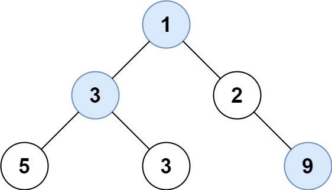

# [515\. 在每个树行中找最大值](https://leetcode.cn/problems/find-largest-value-in-each-tree-row/)

中等

给定一棵二叉树的根节点 `root` ，请找出该二叉树中每一层的最大值。

&nbsp;

**示例1：**

**输入:** root = \[1,3,2,5,3,null,9\]
**输出:** \[1,3,9\]

**示例2：**

**输入:** root = \[1,2,3\]
**输出:** \[1,3\]

&nbsp;

**提示：**

- 二叉树的节点个数的范围是 `[0,104]`
- `-231 <= Node.val <= 231 - 1`

&nbsp;

通过次数 139.2K

提交次数 209.7K

通过率 66.4%

* * *

相关标签

[树](https://leetcode.cn/tag/tree/)
[深度优先搜索](https://leetcode.cn/tag/depth-first-search/)
[广度优先搜索](https://leetcode.cn/tag/breadth-first-search/)
[二叉树](https://leetcode.cn/tag/binary-tree/)

* * *