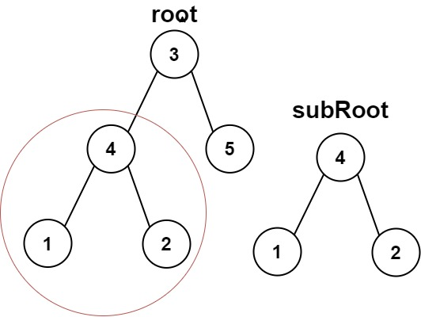
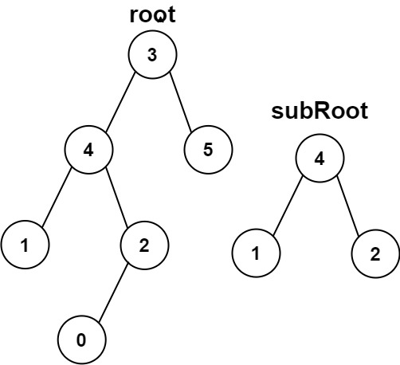

# [572\. 另一棵树的子树](https://leetcode.cn/problems/subtree-of-another-tree/)

简单

给你两棵二叉树 `root` 和 `subRoot` 。检验 `root` 中是否包含和 `subRoot` 具有相同结构和节点值的子树。如果存在，返回 `true` ；否则，返回 `false` 。

二叉树 `tree` 的一棵子树包括 `tree` 的某个节点和这个节点的所有后代节点。`tree` 也可以看做它自身的一棵子树。

&nbsp;

**示例 1：**

**输入：**root = \[3,4,5,1,2\], subRoot = \[4,1,2\]
**输出：**true

**示例 2：**

**输入：**root = \[3,4,5,1,2,null,null,null,null,0\], subRoot = \[4,1,2\]
**输出：**false

&nbsp;

**提示：**

- `root` 树上的节点数量范围是 `[1, 2000]`
- `subRoot` 树上的节点数量范围是 `[1, 1000]`
- `-104 <= root.val <= 104`
- `-104 <= subRoot.val <= 104`

通过次数 193.1K

提交次数 406.6K

通过率 47.5%

* * *

相关标签

[树](https://leetcode.cn/tag/tree/)
[深度优先搜索](https://leetcode.cn/tag/depth-first-search/)
[二叉树](https://leetcode.cn/tag/binary-tree/)
[字符串匹配](https://leetcode.cn/tag/string-matching/)
[哈希函数](https://leetcode.cn/tag/hash-function/)

* * *

提示 1

Which approach is better here- recursive or iterative?

* * *

提示 2

If recursive approach is better, can you write recursive function with its parameters?

* * *

提示 3

Two trees **s** and **t** are said to be identical if their root values are same and their left and right subtrees are identical. Can you write this in form of recursive formulae?

* * *

提示 4

Recursive formulae can be: isIdentical(s,t)= s.val==t.val AND isIdentical(s.left,t.left) AND isIdentical(s.right,t.right)

* * *

相似题目

[统计同值子树](https://leetcode.cn/problems/count-univalue-subtrees/) 中等

[出现次数最多的子树元素和](https://leetcode.cn/problems/most-frequent-subtree-sum/) 中等

* * *