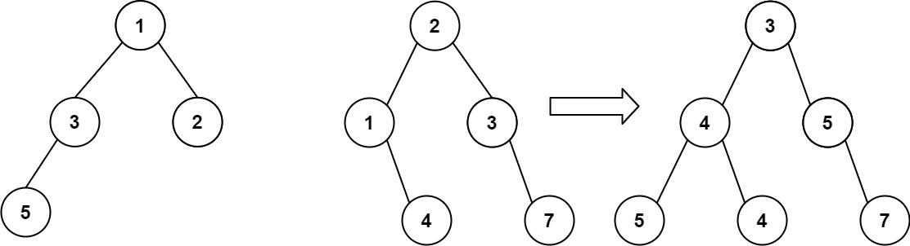

# [617\. 合并二叉树](https://leetcode.cn/problems/merge-two-binary-trees/)

简单

给你两棵二叉树： `root1` 和 `root2` 。

想象一下，当你将其中一棵覆盖到另一棵之上时，两棵树上的一些节点将会重叠（而另一些不会）。你需要将这两棵树合并成一棵新二叉树。合并的规则是：如果两个节点重叠，那么将这两个节点的值相加作为合并后节点的新值；否则，**不为** null 的节点将直接作为新二叉树的节点。

返回合并后的二叉树。

**注意:** 合并过程必须从两个树的根节点开始。

&nbsp;

**示例 1：**

**输入：**root1 = \[1,3,2,5\], root2 = \[2,1,3,null,4,null,7\]
**输出：**\[3,4,5,5,4,null,7\]

**示例 2：**

**输入：**root1 = \[1\], root2 = \[1,2\]
**输出：**\[2,2\]

&nbsp;

**提示：**

- 两棵树中的节点数目在范围 `[0, 2000]` 内
- `-104 <= Node.val <= 104`

* * *

通过次数 478.6K

提交次数 603.3K

通过率 79.3%

* * *

相关标签

[树](https://leetcode.cn/tag/tree/)
[深度优先搜索](https://leetcode.cn/tag/depth-first-search/)
[广度优先搜索](https://leetcode.cn/tag/breadth-first-search/)
[二叉树](https://leetcode.cn/tag/binary-tree/)

* * *