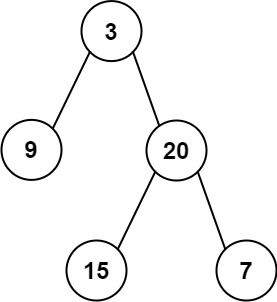
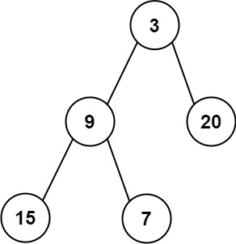

# [637\. 二叉树的层平均值](https://leetcode.cn/problems/average-of-levels-in-binary-tree/)

简单
给定一个非空二叉树的根节点 `root` , 以数组的形式返回每一层节点的平均值。与实际答案相差 `10-5` 以内的答案可以被接受。

&nbsp;

**示例 1：**

**输入：**root = \[3,9,20,null,null,15,7\]
**输出：**\[3.00000,14.50000,11.00000\]
**解释：**第 0 层的平均值为 3,第 1 层的平均值为 14.5,第 2 层的平均值为 11 。
因此返回 \[3, 14.5, 11\] 。

**示例 2:**

**输入：**root = \[3,9,20,15,7\]
**输出：**\[3.00000,14.50000,11.00000\]

&nbsp;

**提示：**

- 树中节点数量在 `[1, 104]` 范围内
- `-231 <= Node.val <= 231 - 1`

通过次数 170.3K

提交次数 242.7K

通过率 70.2%

---

相关标签

[树](https://leetcode.cn/tag/tree/)[深度优先搜索](https://leetcode.cn/tag/depth-first-search/)[广度优先搜索](https://leetcode.cn/tag/breadth-first-search/)[二叉树](https://leetcode.cn/tag/binary-tree/)

---

相似题目

[二叉树的层序遍历](https://leetcode.cn/problems/binary-tree-level-order-traversal/) 中等

[二叉树的层序遍历 II](https://leetcode.cn/problems/binary-tree-level-order-traversal-ii/) 中等

---
