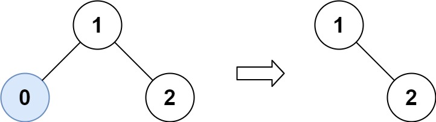
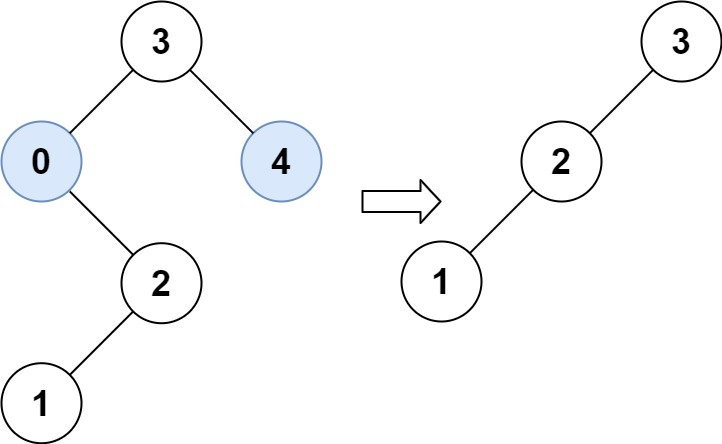

# [669\. 修剪二叉搜索树](https://leetcode.cn/problems/trim-a-binary-search-tree/)

中等

给你二叉搜索树的根节点 `root` ，同时给定最小边界`low` 和最大边界 `high`。通过修剪二叉搜索树，使得所有节点的值在`[low, high]`中。修剪树 **不应该** 改变保留在树中的元素的相对结构 (即，如果没有被移除，原有的父代子代关系都应当保留)。 可以证明，存在 **唯一的答案** 。

所以结果应当返回修剪好的二叉搜索树的新的根节点。注意，根节点可能会根据给定的边界发生改变。

&nbsp;

**示例 1：**

**输入：**root = \[1,0,2\], low = 1, high = 2
**输出：**\[1,null,2\]

**示例 2：**

**输入：**root = \[3,0,4,null,2,null,null,1\], low = 1, high = 3
**输出：**\[3,2,null,1\]

&nbsp;

**提示：**

- 树中节点数在范围 `[1, 104]` 内
- `0 <= Node.val <= 104`
- 树中每个节点的值都是 **唯一** 的
- 题目数据保证输入是一棵有效的二叉搜索树
- `0 <= low <= high <= 104`

* * *

通过次数 156.1K

提交次数 232.6K

通过率 67.1%

* * *

相关标签

[树](https://leetcode.cn/tag/tree/)
[深度优先搜索](https://leetcode.cn/tag/depth-first-search/)
[二叉搜索树](https://leetcode.cn/tag/binary-search-tree/)
[二叉树](https://leetcode.cn/tag/binary-tree/)

* * *