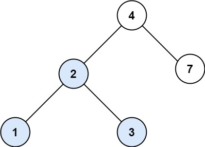

[700\. 二叉搜索树中的搜索](https://leetcode.cn/problems/search-in-a-binary-search-tree/)

简单

给定二叉搜索树（BST）的根节点 `root` 和一个整数值 `val`。

你需要在 BST 中找到节点值等于 `val` 的节点。 返回以该节点为根的子树。 如果节点不存在，则返回 `null` 。

&nbsp;

**示例 1:**

**输入：**root = \[4,2,7,1,3\], val = 2
**输出：**\[2,1,3\]

**示例 2:**

**输入：**root = \[4,2,7,1,3\], val = 5
**输出：**\[\]

&nbsp;

**提示：**

- 树中节点数在 `[1, 5000]` 范围内
- `1 <= Node.val <= 107`
- `root` 是二叉搜索树
- `1 <= val <= 107`

* * *

通过次数 311.7K

提交次数 399.2K

通过率 78.1%

* * *

相关标签

[树](https://leetcode.cn/tag/tree/)
[二叉搜索树](https://leetcode.cn/tag/binary-search-tree/)
[二叉树](https://leetcode.cn/tag/binary-tree/)

* * *

相似题目

[最接近的二叉搜索树值](https://leetcode.cn/problems/closest-binary-search-tree-value/) 简单

[二叉搜索树中的插入操作](https://leetcode.cn/problems/insert-into-a-binary-search-tree/) 中等

* * *