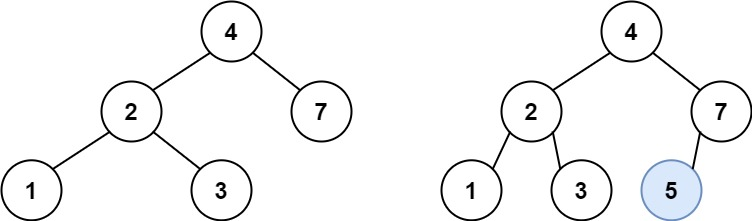
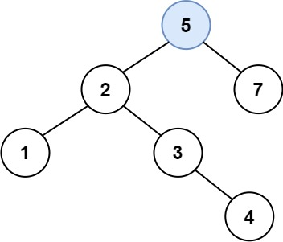

# [701\. 二叉搜索树中的插入操作](https://leetcode.cn/problems/insert-into-a-binary-search-tree/)

中等

给定二叉搜索树（BST）的根节点 `root` 和要插入树中的值 `value` ，将值插入二叉搜索树。 返回插入后二叉搜索树的根节点。 输入数据 **保证** ，新值和原始二叉搜索树中的任意节点值都不同。

**注意**，可能存在多种有效的插入方式，只要树在插入后仍保持为二叉搜索树即可。 你可以返回 **任意有效的结果** 。

&nbsp;

**示例 1：**

**输入：**root = \[4,2,7,1,3\], val = 5
**输出：**\[4,2,7,1,3,5\]
**解释：**另一个满足题目要求可以通过的树是：

**示例 2：**

**输入：**root = \[40,20,60,10,30,50,70\], val = 25
**输出：**\[40,20,60,10,30,50,70,null,null,25\]

**示例 3：**

**输入：**root = \[4,2,7,1,3,null,null,null,null,null,null\], val = 5
**输出：**\[4,2,7,1,3,5\]

&nbsp;

**提示：**

- 树中的节点数将在 `[0, 104]`的范围内。
- `-108 <= Node.val <= 108`
- 所有值 `Node.val` 是 **独一无二** 的。
- `-108 <= val <= 108`
- **保证** `val` 在原始BST中不存在。

* * *

通过次数 232.2K

提交次数 330.7K

通过率 70.2%

* * *

相关标签

[树](https://leetcode.cn/tag/tree/)
[二叉搜索树](https://leetcode.cn/tag/binary-search-tree/)
[二叉树](https://leetcode.cn/tag/binary-tree/)

* * *
相似题目

[二叉搜索树中的搜索](https://leetcode.cn/problems/search-in-a-binary-search-tree/) 简单

* * *