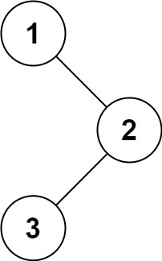

# [94\. 二叉树的中序遍历](https://leetcode.cn/problems/binary-tree-inorder-traversal/)

简单

给定一个二叉树的根节点 `root` ，返回 *它的 **中序** 遍历* 。

&nbsp;

**示例 1：**

**输入：**root = \[1,null,2,3\]
**输出：**\[1,3,2\]

**示例 2：**

**输入：**root = \[\]
**输出：**\[\]

**示例 3：**

**输入：**root = \[1\]
**输出：**\[1\]

&nbsp;

**提示：**

- 树中节点数目在范围 `[0, 100]` 内
- `-100 <= Node.val <= 100`

&nbsp;

**进阶:** 递归算法很简单，你可以通过迭代算法完成吗？

通过次数 1.3M

提交次数 1.7M

通过率 76.4%

* * *

相关标签

[栈](https://leetcode.cn/tag/stack/)[树](https://leetcode.cn/tag/tree/)[深度优先搜索](https://leetcode.cn/tag/depth-first-search/)[二叉树](https://leetcode.cn/tag/binary-tree/)

* * *

相似题目

[验证二叉搜索树](https://leetcode.cn/problems/validate-binary-search-tree/) 中等

[二叉树的前序遍历](https://leetcode.cn/problems/binary-tree-preorder-traversal/) 简单

[二叉树的后序遍历](https://leetcode.cn/problems/binary-tree-postorder-traversal/) 简单

[二叉搜索树迭代器](https://leetcode.cn/problems/binary-search-tree-iterator/) 中等

[二叉搜索树中第K小的元素](https://leetcode.cn/problems/kth-smallest-element-in-a-bst/) 中等

[最接近的二叉搜索树值 II](https://leetcode.cn/problems/closest-binary-search-tree-value-ii/) 困难

[二叉搜索树中的中序后继](https://leetcode.cn/problems/inorder-successor-in-bst/) 中等

[将二叉搜索树转化为排序的双向链表](https://leetcode.cn/problems/convert-binary-search-tree-to-sorted-doubly-linked-list/) 中等

[二叉搜索树节点最小距离](https://leetcode.cn/problems/minimum-distance-between-bst-nodes/) 简单

* * *